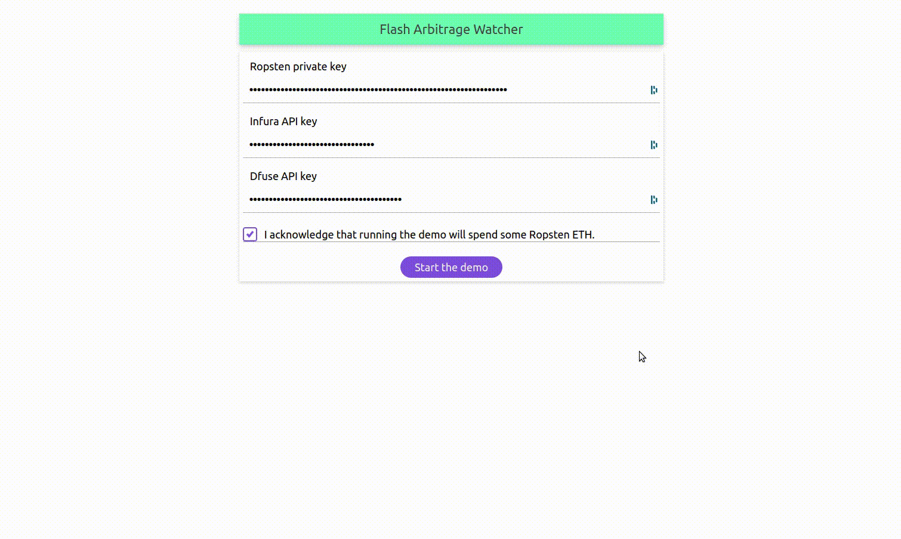

<h1 align="center">Welcome to flash-arbitrage-watcher 👋</h1>
<p>
  
  <a href="https://raw.githubusercontent.com/n0name-sw3/flash-arbitrage-watcher/master/LICENSE" target="_blank">
    
  </a>
</p>

> This project aims to prove the concept of a fast arbitrage monitoring system leveraging Aave flash loans for fast arbitrage and Dfuse Lifecycle for safe monitoring.
>
> It has been submitted as a response to the [Sustain Web3 challenge](https://gitcoin.co/blog/sustain-web3-hackathon/) in the [_Most Innovative Integration of dfuse Lifecycle_](https://github.com/dfuse-io/hackathons/issues/3) category.



## ✨ [Demo](https://n0name-sw3.github.io/flash-arbitrage-watcher/)

#### Set-up

The demo starts by requesting three secret parameters :
- an Ethereum private key, with some Ropsten ether on it. It should be given in hexa-format, prefixed with `0x`.
- a valid Infura key.
- a Dfuse API secret key.

Users should be warned that **the demo runs on the Ropsten public testnet** and that **some Ropsten ether will be used during the process**.

#### Workflow

##### Overview

Multiple decentralized exchanges (DEXes) may, at a certain time, provide different prices for a given pair of token.
When the difference is large enough, some arbitrage opportunities arise, allowing for some direct profit and contributing to the stability of prices.

In this demo, we use the example of two major DEXes (Uniswap and Kyber) and the exchange rate of BAT tokens against DAI.

[Aave](https://aave.com/) is a market protocol which introduces, in addition to traditional overcollateralized loans, the notion of undercollateralized loans with _flash loans_.

**Flash loans** allow anyone to **use the liquidity pool** of a given token **with no personal collateral under the condition that the loan is contracted and repaid in the same transaction**.
In the context of arbitrage, transactions can thus use larger amounts of tokens and consequently speed up arbitrage and stabilisation of prices.

**However, transactions that would virtually benefit from arbitrage and return some new tokens to the sender when broadcast may, as new transactions are integrated to the block, change DEX rates and make the original transaction less profitable or even not profitable anymore.**
**That is the reason why Dfuse Lifecycle can be very useful in this context.**
As exchange rates are fetched, **expected returns from arbitrage are continuously computed.**
Every time a positive return is expected, an arbitrage transaction is broadcast that leverages flash loans to maximize the amount of tokens at stake and expand returns.
**As long as this transaction is not mined, exchange rates are still watched so that if broadcast transaction becomes less profitable then it can be cancelled by broadcasting an _empty_ replacement transaction.**


##### Details of the demo

In the demo, exchange rates are simulated.
In practice, any pending transaction which updates order books of DEXes should be watched with Dfuse in order to continuously compute current exchange rates.
With simple rules integrating maximum price slippage, a minimum expected return on arbitrage is computed.
If the latter becomes greater than Aave flash loan fees, then **a transaction is automatically broadcast to leverage Aave liquidity pool and benefit from arbitrage opportunities.**

While this first transaction is pending, in the demo **the returns from arbitrage grow into negative ones and the transaction becomes non-profitable** and even costly because of flash loan fees.
**A [replacement transaction ](https://ropsten.etherscan.io/tx/0x7c3ed3ba48f3976efde8a260d124e7bfd736d365e62ee9e6903c4728e0953160) is thus automatically broadcast with a higher gas price to cancel the first transaction.**

In the demo, the **returns from arbitrage then become profitable again**.
**A new transaction leveraging flash loans is broadcast.**
As we can see in [details of the transaction](https://ropsten.etherscan.io/tx/0xf6e1635240528a58bca2dcc68697729d776325f5d541e13fb452369a921241f6), the flash loan feature is actually implemented (1 DAI is borrowed during the transaction).
Exchange rates being simulated for the sake of the demo, the selling and buying operations are not executed on DEXes though.

In real condition, instead of the low amount of DAI borrowed in this proof of concept, more than [563970 DAI](https://etherscan.io/address/0xfC1E690f61EFd961294b3e1Ce3313fBD8aa4f85d#readContract) and [276085 BAT](https://etherscan.io/address/0xe1ba0fb44ccb0d11b80f92f4f8ed94ca3ff51d00#readContract) could be instantly borrowed from Aave liquidity pools with no personal collateral required.

As demonstrated in this PoC, Dfuse Lifecycle helps adding some safety to the process.
It doesn't protect from _Miner Extractable Value_ operations which are however less likely to take place in practice.

## Available Scripts

### Install

```sh
yarn install
```

### Usage

```sh
yarn start
```

### Run tests

```sh
yarn test
```

### Lint

```sh
yarn lint
```

## 🤝 Contributing

Contributions, issues and feature requests are welcome!<br />Feel free to check [issues page](https://github.com/n0name-sw3/flash-arbitrage-watcher/issues). 

## Show your support

Give a ⭐️ if this project helped you!

## 📝 License

Copyright © 2020 [n0name-sw3](https://github.com/n0name-sw3).<br />
This project is [Unlicense](https://github.com/n0name-sw3/flash-arbitrage-watcher/blob/master/LICENSE) licensed.

***
_This README was generated with ❤️ by [readme-md-generator](https://github.com/kefranabg/readme-md-generator)_
